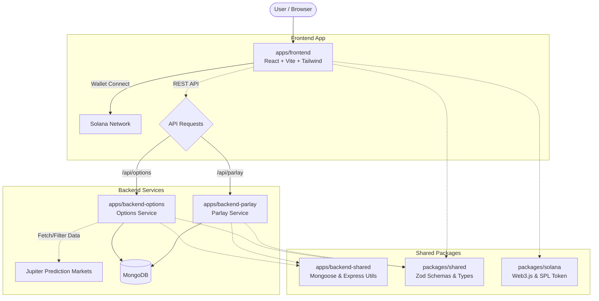

# ProbLab 🧪🎲

PROBLAB is a derivatives layer for prediction markets on Solana. It enables users to go beyond simple YES/NO bets by offering structured financial products like Parlays, Options and many more built on top of prediction market outcomes. With Parlay, users can bundle multiple event predictions into a single position for amplified returns if all outcomes resolve correctly. With Options, users trade on probability movement itself, like buying CALLs if they believe an event’s probability will rise or PUTs if they believe it will fall before expiry.

## 🏗️ Architecture & Packages

The project is structured as a modern Monorepo using **Turborepo** and **Bun**. It separates concerns across multiple microservices and shared packages:



### 📦 Workspaces

- **`apps/frontend`**: The user interface built with React, Vite, and TailwindCSS. Uses `@solana/wallet-adapter` and `@reown/appkit` for wallet connectivity.
- **`apps/backend-options`**: Responsible for indexing and caching prediction market data. It regularly polls the Jupiter API, filters markets for liquidity and viability, and schedules market probability snapshots.
- **`apps/backend-parlay`**: The core parlay execution engine. Manages user parlay bets, tracks expiration, and runs automated CRON jobs for settlement.
- **`apps/backend-shared`**: Shared database connections (`mongoose`), security middlewares, rate-limiting, and error handling for the backend services.

## 🛠️ Tech Stack

- **Package Manager:** Bun
- **Monorepo:** Turborepo
- **Frontend:** React, Vite, TailwindCSS, React Router
- **Backend:** Node.js, Express, Mongoose (MongoDB)
- **Blockchain:** Solana Web3.js, Wallet Adapter, SPL Tokens
- **Validation:** Zod

## 🚀 Getting Started

### Prerequisites

Ensure you have [Bun](https://bun.sh/) installed. If you are on Windows, ensure Long Paths are enabled in your registry to prevent `MAX_PATH` symlink issues during installation.

### Installation

Clone the repository and install all workspace dependencies:

```bash
bun install
```

### Running the Development Environment

Start all apps and services simultaneously in watch mode:

```bash
bun run dev
```

Alternatively, you can start specific services using turbo filters:

```bash
bun run dev:frontend
bun run dev:options
bun run dev:parlay
```